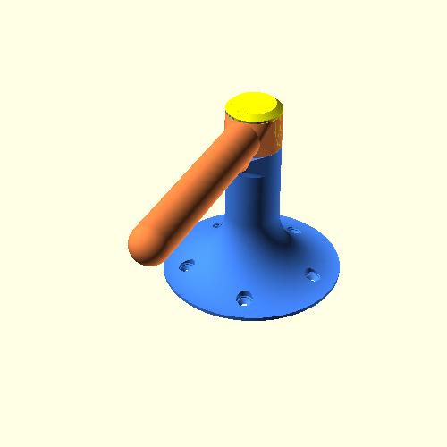

I needed a hold back for my shower curtain, so I designed one. It's basically a rotatable lever with a stopper. Diameter, length and many more is customizable.

[GitHub](https://github.com/Mr-Clear/CurtainHoldback) -
[Thingiverse](https://www.thingiverse.com/thing:7010965) -
Made with [OpenSCAD 2025.04.10](https://openscad.org/downloads.html#snapshots)

